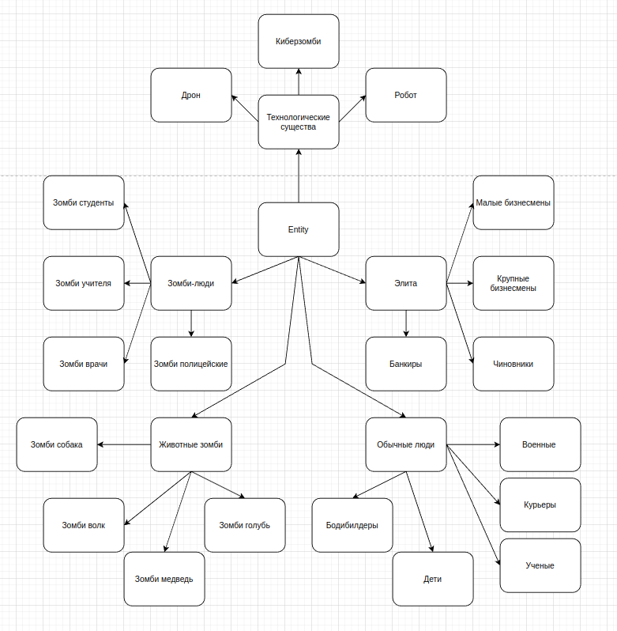

# Архитектурное описание системы

## Общее описание
Программа представляет собой карточную RPG игру, где игроки могут сражаться друг с другом или с ИИ, используя различные карты. Игра включает в себя иерархию персонажей, карт и способностей, а также простой ИИ для одиночной игры.

## Требования к системе
1. Игра должна поддерживать несколько режимов взаимодействия:
   - Бой между игроками.
   - Бой между игроком и ИИ.
   - Улучшение карт игроков.
2. Игра должна иметь иерархию из не менее чем 20 классов.
3. Игра должна поддерживать простой ИИ для одиночной игры.

## Сценарии использования
1. **Сценарий 1: Бой между игроками**
   - Игрок 1 выбирает карту и атакует Игрока 2.
   - Игрок 2 выбирает карту для защиты или контратаки.
   - Игра определяет результат боя и выдает награду за бой в виде монет, обновляется здоровье игроков.

2. **Сценарий 2: Бой с ИИ**
   - Игрок выбирает карту и атакует ИИ.
   - ИИ автоматически выбирает карту для защиты или контратаки.
   - Игра определяет результат боя и выдает награду за бой игроку, обновляется здоровье игрока и ИИ.

3. **Сценарий 3:  Улучшение карт**
   - Игрок выбирает способность для улучшения.
   - Программа проверяет баланс монет у игрока.
   - Если баланс достаточен для улучшения, то игра списывает сумму нужную для улучшения и производить улучшение способности.

## Диаграмма компонент

### Описание компонент

1. Game Engine (Игровой движок):
Описание: 
Основной компонент, который управляет всей логикой игры. Отвечает за обработку игровых событий, взаимодействие между объектами и общее управление игрой.

Функции:
Управление игровым циклом (начало, пауза, завершение игры).
Обработка взаимодействий между персонажами, картами и способностями.
Управление переходами между режимами игры (бой, улучшение способностей и т.д.).

2. Player System (Система игрока):
Описание: 
Компонент, отвечающий за управление игроками. Включает в себя управление здоровьем, монетами, картами и способностями.

Функции:
Управление инвентарём игрока (карты, способности).
Обработка действий игрока (ходы в бою, улучшение карт).
Управление монетами (начисление и трата).

3. AI System (Система ИИ):
Описание: 
Компонент, отвечающий за поведение ИИ в игре. Включает в себя логику для автоматической игры.

Функции:
Принятие решений ИИ в бою (выбор карт для атаки или защиты).
Управление улучшениями карт ИИ.
Обработка взаимодействий ИИ с игроком.

4. Card System (Система карт):
Описание: 
Компонент, отвечающий за управление картами и их взаимодействием. Включает в себя создание, использование и улучшение карт.

Функции:
Управление колодой карт игрока и ИИ.
Обработка эффектов карт (атака, защита, лечение).
Управление улучшением карт (повышение характеристик).

5. Coin System (Система монет):
Описание: 
Компонент, отвечающий за управление монетами. Игроки получают монеты за бои и тратят их на улучшение карт.

Функции:
Начисление монет за победы в боях.
Списание монет за улучшение карт.
Управление балансом монет у игрока и ИИ.

6. Ability System (Система способностей):
Описание: 
Компонент, отвечающий за управление способностями карт. Включает в себя активацию и улучшение способностей.

Функции:
Активация способностей во время боя.
Улучшение способностей за монеты.
Управление эффектами способностей (например, увеличение атаки или защиты).

7. Battle System (Система боя):
Описание: 
Компонент, отвечающий за логику боя между игроком и ИИ или между игроками.

Функции:
Обработка ходов игрока и ИИ.
Определение результата боя (победа, поражение, ничья).
Управление здоровьем и атакой персонажей во время боя.

8. UI System (Система пользовательского интерфейса):
Описание: 
Компонент, отвечающий за отображение информации игроку и взаимодействие с интерфейсом.

Функции:
Отображение здоровья, монет, карт и способностей.
Обработка ввода игрока (выбор карт, улучшение способностей).
Отображение результатов боя и других событий.

## Диаграмма классов

### Описание классов

Зомби-люди
- **Зомби-полицейские**: Обладают повышенной защитой и могут атаковать с помощью дубинок.
- **Зомби-студенты**: Быстрые и проворные, но с низким здоровьем.
- **Зомби-врачи**: Могут восстанавливать свое здоровье во время боя.
- **Зомби-учителя**: Могут "обучать" свою карту, увеличивая свои характеристики.

Элита
- **Чиновники**: Имеют повышенный процент наград за бой.
- **Крупные бизнесмены**: Имеют повышенный процент наград за бой, повышенный урон.
- **Банкиры**: Имеют повышенный процент наград за бой, повышенная защита.
- **Малые бизнесмены**: Имеют повышенный процент наград за бой, способны улучшать одну из способностей на один бой.

Обычные люди
- **Бодибилдеры**: Обладают высокой силой и выносливостью.
- **Дети**: Быстрые и незаметные, но с низким здоровьем.
- **Ученые**: Имеют высокий интеллект.
- **Военные**: Обладают высокой атакой и защитой.
- **Курьеры**: Повышенная атака и защита.

Животные-зомби
- **Зомби-медведи**: Обладают высокой силой и здоровьем.
- **Зомби-собаки**: Быстрые и имеют повышенную защиту.
- **Зомби-волки**: Быстрые и имеют повышенную атаку.
- **Зомби-голуби**: Мало здоровья но обладают двойным уроном за одну атаку.

Технологические существа
- **Киберзомби**: Гибрид зомби и робота, обладающий высокой защитой и атакой.
- **Дроны**: Могут отражать урон сопернику.
- **Роботы**: Обладают высокой защитой.

## План тестирования
1. **Модульное тестирование**:
   - Тестирование логики боя между игроками.

2. **Интеграционное тестирование**:
   - Тестирование взаимодействия между компонентами (между игроком и ИИ/игроком).

3. **Системное тестирование**:
   - Тестирование всех режимов игры (бой, улучшение карт, ИИ).

4. **Регрессионное тестирование**:
   - Проверка, что новые изменения не сломали существующую функциональность.